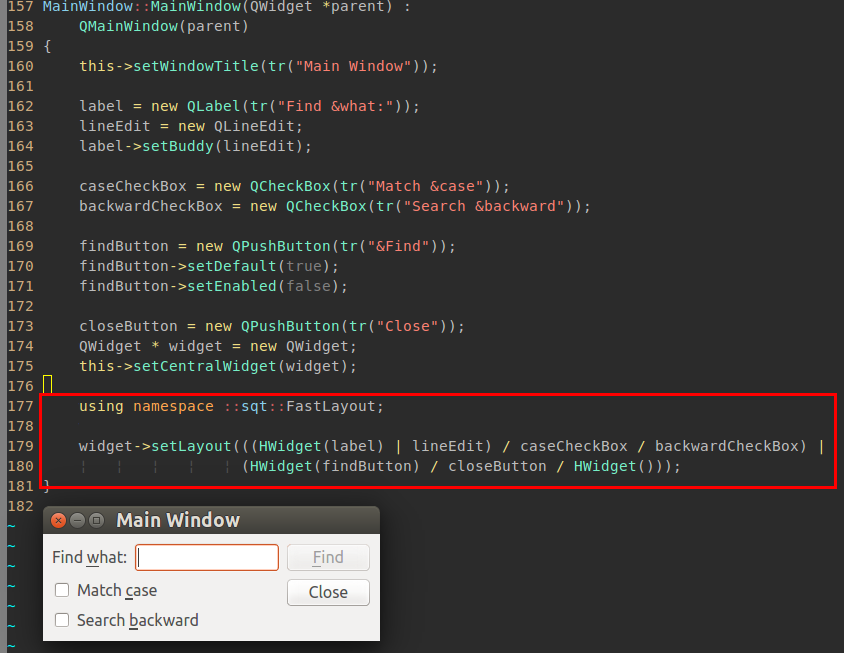

# SQT = Sarrow's Qt exTension

# 我的Qt扩展

> sqt
>     ├── QFastLayout.hpp
>     └── QNetHelper.hpp

## QFastLayout.hpp qt界面快速布局。

### 范例以及效果图

### 原理

操作符重载。  
实现简单，共两个类，8个外部函数。  
100多行，纯头文件可用。

### 起源

界面往往只关心widget；手动编写界面的话layout，又必须给不怎么用的layout命名——不厌其烦。

于是捣鼓了上面这个东西。

### 使用说明

    |
    	水平串接两个widget或者layout
    /
    	垂直串接两个widget或者layout

    HWidget()
    	无参数构造函数（或者传入0指针）——生成一个stretch属性的QSpacerItem；

## QNetHelper.hpp qt网络组件辅助类

说明，略
